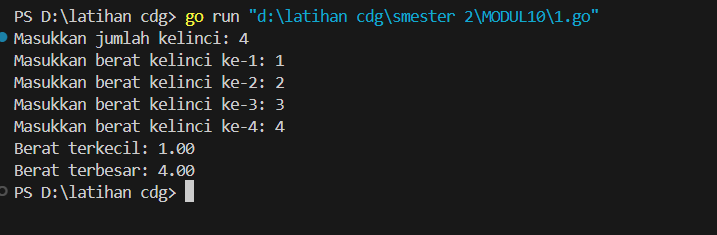
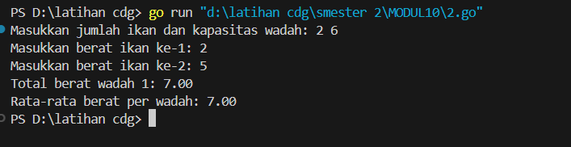
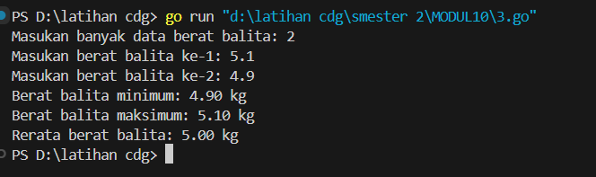

<h1 style="text-align: center;">Laporan Praktikum Modul 10<br>Pencarian Nilai Ekstrim Pada Himpunan Data</h1>
<p style="text-align: center;">Fa'iq Jagadhita Hadiana - 103112430015</p>

### Soal 1

```go
package main

import "fmt"

func main() {
	var N int
	var berat [1000]float64

	fmt.Print("Masukkan jumlah kelinci: ")
	fmt.Scan(&N)

	for i := 0; i < N; i++ {
		fmt.Printf("Masukkan berat kelinci ke-%d: ", i+1)
		fmt.Scan(&berat[i])
	}

	min := berat[0]
	max := berat[0]

	for i := 1; i < N; i++ {
		if berat[i] < min {
			min = berat[i]
		}
		if berat[i] > max {
			max = berat[i]
		}
	}

	fmt.Printf("Berat terkecil: %.2f\n", min)
	fmt.Printf("Berat terbesar: %.2f\n", max)
}
```

Penjelasan :
Program ini adalah program sederhana yang digunakan buat mencari berat kelinci paling ringan dan paling berat dari sejumlah data yang diinput pengguna. Jadi, pertama-tama program ini minta jumlah kelinci yang mau dicek beratnya. Setelah itu, user disuruh masukin berat tiap kelinci satu per satu. Nah, setelah semua berat dimasukin, program akan nyari nilai terkecil dan terbesar dari data berat yang udah dikumpulin tadi. Terakhir, dia bakal nampilin berat terkecil dan terbesar itu ke layar.

Algoritma yang digunakan:

- Baca jumlah data yang akan diinput.
- Simpan semua data berat ke dalam array.
- Inisialisasi nilai minimum dan maksimum dengan elemen pertama array.
- Lakukan perulangan dari elemen kedua sampai akhir: bandingkan dan perbarui nilai minimum atau maksimum jika ditemukan nilai yang lebih kecil atau besar.
- Tampilkan hasil akhir berupa nilai minimum dan maksimum.
### Soal 2
```go
package main

import "fmt"

func main() {
	var x, y int
	var berat [1000]float64

	fmt.Print("Masukkan jumlah ikan dan kapasitas wadah: ")
	fmt.Scan(&x, &y)

	for i := 0; i < x; i++ {
		fmt.Printf("Masukkan berat ikan ke-%d: ", i+1)
		fmt.Scan(&berat[i])
	}

	jumlahWadah := (x + y - 1) / y
	var totalWadah [1000]float64

	idx := 0
	for i := 0; i < jumlahWadah; i++ {
		var total float64 = 0
		for j := 0; j < y && idx < x; j++ {
			total += berat[idx]
			idx++
		}
		totalWadah[i] = total
	}

	var totalSemua float64 = 0
	for i := 0; i < jumlahWadah; i++ {
		fmt.Printf("Total berat wadah %d: %.2f\n", i+1, totalWadah[i])
		totalSemua += totalWadah[i]
	}

	rata := totalSemua / float64(jumlahWadah)
	fmt.Printf("Rata-rata berat per wadah: %.2f\n", rata)
}
```

Penjelasan :
Program ini adalah program buat ngitung total dan rata-rata berat ikan per wadah. Jadi, user disuruh masukin berapa jumlah ikan dan kapasitas maksimal tiap wadah (berapa ekor ikan yang muat di satu wadah). Terus, user masukin berat dari tiap ikan satu-satu. Program bakal otomatis bagi ikan-ikan itu ke dalam wadah berdasarkan kapasitas, ngitung total berat di tiap wadah, terus ditampilin satu-satu. Di akhir, program juga ngitung rata-rata berat per wadah dan nampilin hasilnya. Cocok nih kalau lagi bantuin bagi hasil tangkapan ikan ke beberapa ember!

Algoritma yang digunakan:

- Input jumlah ikan dan kapasitas wadah.
- Simpan berat tiap ikan ke dalam array.
- Hitung jumlah wadah yang dibutuhkan dengan rumus pembulatan ke atas.
- Iterasi array ikan dan isi wadah satu per satu sambil menjumlahkan berat di tiap wadah.
- Setelah semua wadah terisi, tampilkan total berat masing-masing wadah.
- Hitung rata-rata berat per wadah dan tampilkan.
### Soal 3
```go
package main

import "fmt"

type arrBalita [100]float64

func hitungMinMax(arr arrBalita, n int, bMin, bMax *float64) {
	*bMin = arr[0]
	*bMax = arr[0]
	for i := 1; i < n; i++ {
		if arr[i] < *bMin {
			*bMin = arr[i]
		}
		if arr[i] > *bMax {
			*bMax = arr[i]
		}
	}
}

func rerata(arr arrBalita, n int) float64 {
	var total float64 = 0
	for i := 0; i < n; i++ {
		total += arr[i]
	}
	return total / float64(n)
}

func main() {
	var berat arrBalita
	var n int

	fmt.Print("Masukan banyak data berat balita: ")
	fmt.Scan(&n)

	for i := 0; i < n; i++ {
		fmt.Printf("Masukan berat balita ke-%d: ", i+1)
		fmt.Scan(&berat[i])
	}

	var min, max float64
	hitungMinMax(berat, n, &min, &max)
	rata := rerata(berat, n)

	fmt.Printf("Berat balita minimum: %.2f kg\n", min)
	fmt.Printf("Berat balita maksimum: %.2f kg\n", max)
	fmt.Printf("Rerata berat balita: %.2f kg\n", rata)
}
```

Penjelasan :
Program ini adalah program buat ngolah data berat badan balita. Jadi, user diminta masukin jumlah data berat balita yang mau dianalisis, lalu beratnya dimasukin satu per satu. Program ini punya dua fungsi bantu: satu buat nyari berat minimum dan maksimum, dan satu lagi buat ngitung rata-rata dari semua berat. Setelah proses selesai, hasilnya langsung ditampilkan, mulai dari berat balita terendah, tertinggi, sampai rata-ratanya. 

Algoritma yang digunakan:

- Input jumlah data dan simpan semua berat balita ke dalam array.
- Gunakan fungsi khusus untuk mencari nilai minimum dan maksimum dengan membandingkan elemen satu per satu.
- Gunakan fungsi lain untuk menjumlahkan semua elemen dan bagi dengan jumlah data untuk dapatkan rata-rata.
- Tampilkan nilai minimum, maksimum, dan rata-ratanya.
