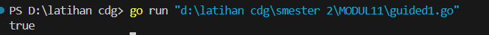
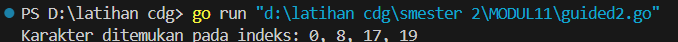
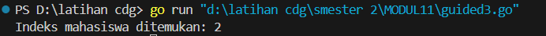
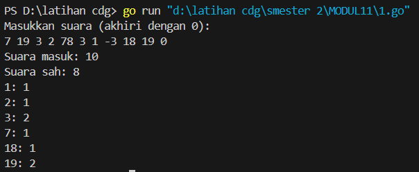
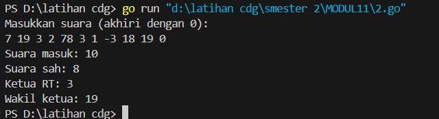
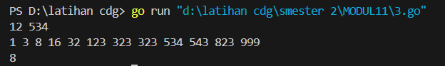

<h1 style="text-align: center;">Laporan Praktikum Modul 11<br>PENCARIAN NILAI ACAK PADA HIMPUNAN DATA</h1>
<p style="text-align: center;">Fa'iq Jagadhita Hadiana - 103112430015</p>

___
## Guided

___

#### Soal 1

```go
package main

import "fmt"

func cariBarang(daftar []string, x string) bool {
	for _, barang := range daftar {
		if barang == x {
			return true
		}
	}
	return false
}

func main () {

	daftarBarang := []string{"sabun", "sampo", "odol", "tisu", "minyak"}
	barangDicari := "odol"

	ditemukan := cariBarang(daftarBarang, barangDicari)

	fmt.Println(ditemukan)
}

```



Penjelasan :
Program ini dibuat dengan bahasa Go dan tujuannya adalah untuk mencari apakah suatu barang ada di dalam daftar barang yang sudah ditentukan. Program memiliki dua bagian utama: fungsi cariBarang dan fungsi main.Fungsi cariBarang bertugas melakukan pencarian. Fungsi ini menerima dua input, yaitu daftar barang dan nama barang yang ingin dicari. Ia akan memeriksa setiap barang dalam daftar satu per satu. Jika barang yang dicari ditemukan, maka fungsi ini langsung mengembalikan nilai true. Jika sudah dicek semua dan barangnya tidak ada, maka akan mengembalikan nilai false. Lalu di bagian main, daftar barang didefinisikan terlebih dahulu, misalnya seperti sabun, sampo, odol, dan lain-lain. Kemudian ada satu nama barang yang ingin dicari, misalnya "odol". Program akan memanggil fungsi cariBarang untuk mengecek apakah "odol" ada dalam daftar. Hasil dari pengecekan itu disimpan dalam variabel, dan akhirnya hasil tersebut ditampilkan ke layar. Karena "odol" memang ada dalam daftar, maka output yang muncul dari program ini adalah true.

___
#### Soal 2

```go
package main

import "fmt"

func seqSearch(kalimat string, karakter byte) []int {
	var posisi []int
	for i := 0; i < len(kalimat); i++ {
		if kalimat[i] == karakter {
			posisi = append(posisi, i)
		}
	}
	return posisi
}

func main() {
	var kalimat string
	var karakter rune

	kalimat = "algoritma pemrograman"
	karakter = 'a'
	posisi := seqSearch(kalimat, byte(karakter))

	if len(posisi) > 0 {
		fmt.Print("Karakter ditemukan pada indeks: ")
		for i := 0; i < len(posisi); i++ {
			fmt.Print(posisi[i])
			if i != len(posisi)-1 {
				fmt.Print(", ")
			}
		}
	} else {
		fmt.Println("Karakter tidak ditemukan.")
	}
}
```



Penjelasan :
Program ini dibuat dengan bahasa Go dan tujuannya adalah untuk mencari di mana saja sebuah karakter tertentu muncul dalam sebuah kalimat. Program ini terdiri dari dua bagian utama: fungsi seqSearch dan fungsi main. Fungsi seqSearch bertugas melakukan pencarian posisi karakter dalam kalimat. Fungsi ini menerima dua input, yaitu sebuah kalimat (berisi teks) dan satu karakter yang ingin dicari. Fungsi akan memeriksa setiap karakter dalam kalimat satu per satu. Jika karakter yang sedang diperiksa sama dengan karakter yang dicari, maka indeks (posisi) karakter tersebut akan disimpan ke dalam sebuah daftar. Setelah semua karakter dalam kalimat diperiksa, fungsi ini akan mengembalikan daftar posisi di mana karakter ditemukan. Jika tidak ada karakter yang cocok, daftar tersebut akan kosong. Lalu di bagian main, kalimat ditentukan terlebih dahulu, misalnya "algoritma pemrograman". Kemudian karakter yang ingin dicari juga ditentukan, misalnya 'a'. Program akan memanggil fungsi seqSearch untuk mencari karakter 'a' dalam kalimat tersebut. Hasil dari pencarian berupa daftar posisi akan disimpan dalam sebuah variabel. Jika karakter ditemukan, maka program akan mencetak semua posisi kemunculan karakter tersebut. Jika tidak ditemukan, akan muncul pesan bahwa karakter tidak ditemukan. Karena karakter 'a' memang ada dalam kalimat tersebut, maka output yang muncul dari program ini adalah daftar indeks di mana 'a' ditemukan 0, 8, 17, 19.

___
#### Soal 3

```go
package main

import (
	"fmt"
)

type Mahasiswa struct {
	nama string
	nim  string
}

func binarySearch(mahasiswa []Mahasiswa, nim string) int {
	start := 0
	end := len(mahasiswa) - 1

	for start <= end {
		tengah := (start + end) / 2
		if mahasiswa[tengah].nim == nim {
			return tengah 
		} else if mahasiswa[tengah].nim < nim {
			start = tengah + 1 
		} else {
			end = tengah - 1 
		}
	}

	return -1 
}

func main() {
	
	mahasiswa := []Mahasiswa{
		{nama: "andi", nim: "220001"},
		{nama: "budi", nim: "220002"},
		{nama: "citra", nim: "220003"},
		{nama: "doni", nim: "220004"},
	}

	X := "220003"

	index := binarySearch(mahasiswa, X)

	if index != -1 {
		fmt.Printf("Indeks mahasiswa ditemukan: %d\n", index)
	} else {
		fmt.Println("Nim tidak ditemukan")
	}
}

```



Penjelasan :
Program ini dibuat dengan bahasa Go dan tujuannya adalah untuk mencari data mahasiswa berdasarkan NIM menggunakan metode binary search. Program terdiri dari dua bagian utama: tipe data Mahasiswa dan dua fungsi utama yaitu binarySearch dan main. Program menggunakan struktur data bertipe Mahasiswa, yang terdiri dari dua informasi: nama dan NIM. Data mahasiswa disimpan dalam slice (seperti array dinamis), dan diasumsikan sudah terurut berdasarkan NIM secara menaik. Ini penting karena binary search hanya bisa digunakan pada data yang sudah terurut. Fungsi binarySearch bertugas mencari mahasiswa berdasarkan NIM-nya. Fungsi ini menerima dua input, yaitu slice mahasiswa dan NIM yang ingin dicari. Algoritmanya bekerja dengan cara membandingkan NIM yang dicari dengan NIM mahasiswa di tengah slice. Jika cocok, maka langsung mengembalikan indeks mahasiswa tersebut. Jika NIM yang dicari lebih kecil, pencarian dilanjutkan ke bagian kiri; jika lebih besar, ke bagian kanan. Proses ini terus diulang hingga data ditemukan atau pencarian habis. Jika NIM tidak ditemukan, maka fungsi mengembalikan nilai -1. Di bagian main, dibuat daftar mahasiswa yang terdiri dari empat orang dengan NIM yang sudah berurutan. Kemudian, NIM yang ingin dicari ditentukan, misalnya "220003". Program memanggil fungsi binarySearch untuk mencari NIM tersebut. Hasil pencarian disimpan dalam variabel index. Jika hasil pencarian bukan -1, artinya mahasiswa ditemukan dan indeksnya akan dicetak. Jika -1, maka akan ditampilkan pesan bahwa NIM tidak ditemukan. Karena NIM "220003" memang ada di daftar dan berada di indeks ke-2, maka output yang muncul dari program ini adalah: Indeks mahasiswa ditemukan : 2

___
## Unguided

___

#### Soal 1

```go
package main

import "fmt"

const maxCalon = 20

func bacaSuara() []int {
	var suara int
	var suaraMasuk []int

	fmt.Println("Masukkan suara (akhiri dengan 0):")
	for {
		fmt.Scan(&suara)
		if suara == 0 {
			break
		}
		suaraMasuk = append(suaraMasuk, suara)
	}
	return suaraMasuk
}

func hitungSuaraSah(suaraMasuk []int) (int, []int) {
	var perolehan = make([]int, maxCalon+1)
	var totalSah int

	for _, s := range suaraMasuk {
		if s >= 1 && s <= maxCalon {
			perolehan[s]++
			totalSah++
		}
	}
	return totalSah, perolehan
}

func tampilkanHasil(totalMasuk, totalSah int, perolehan []int) {
	fmt.Printf("Suara masuk: %d\n", totalMasuk)
	fmt.Printf("Suara sah: %d\n", totalSah)

	for i := 1; i <= maxCalon; i++ {
		if perolehan[i] > 0 {
			fmt.Printf("%d: %d\n", i, perolehan[i])
		}
	}
}

func main() {
	suaraMasuk := bacaSuara()
	totalMasuk := len(suaraMasuk)
	totalSah, perolehan := hitungSuaraSah(suaraMasuk)

	tampilkanHasil(totalMasuk, totalSah, perolehan)
}

```



Penjelasan :
Program ini dibuat menggunakan bahasa Go dan digunakan untuk menghitung hasil dari sebuah pemilihan ketua RT. Dalam pemilihan ini, tersedia 20 calon ketua RT, dan warga dapat memilih dengan cara memasukkan nomor calon yang diinginkan. Namun, terkadang terdapat input yang tidak valid, seperti angka di luar jangkauan 1 sampai 20, sehingga program ini juga melakukan validasi terhadap data suara yang masuk. Pertama, program akan meminta pengguna untuk memasukkan suara satu per satu. Proses input ini akan terus berjalan sampai pengguna memasukkan angka 0, yang menandakan akhir dari data input. Setiap angka yang dimasukkan sebelum angka 0 akan dianggap sebagai suara yang masuk. Setelah semua data dikumpulkan, program akan menghitung total suara yang masuk. Kemudian, program memeriksa satu per satu angka tersebut untuk menentukan apakah suara itu valid atau tidak. Suara dianggap sah jika nilainya antara 1 sampai 20. Suara yang sah akan dihitung dan disimpan sebagai perolehan suara untuk calon yang bersangkutan. Suara yang tidak sah akan diabaikan. Setelah proses validasi selesai, program akan menampilkan tiga hal. Pertama, jumlah total suara yang masuk (termasuk yang tidak sah). Kedua, jumlah suara sah. Ketiga, daftar calon-calon yang memperoleh suara beserta jumlah suara yang mereka terima. Hanya calon yang mendapatkan suara yang akan ditampilkan. Sebagai contoh, jika warga memasukkan suara dengan urutan seperti 7, 19, 3, 2, 78, 3, 1, -3, 18, 19, dan diakhiri dengan 0, maka total suara yang masuk adalah 10. Dari jumlah itu, 8 suara dianggap sah karena hanya suara dengan nilai antara 1 sampai 20 yang dihitung. Hasil akhir akan menunjukkan calon nomor 1, 2, 3, 7, 18, dan 19 masing-masing dengan jumlah suara yang sesuai. Dengan cara ini, program dapat secara efisien membantu menghitung hasil pemungutan suara dan memastikan hanya suara yang valid yang diperhitungkan dalam penentuan pemenang.
#### Soal 2

```go
package main

import "fmt"

const maxCalon = 20

func ambilSuara() []int {
	var suara int
	var daftarSuara []int

	fmt.Println("Masukkan suara (akhiri dengan 0):")
	for {
		fmt.Scan(&suara)
		if suara == 0 {
			break
		}
		daftarSuara = append(daftarSuara, suara)
	}
	return daftarSuara
}

func hitungDanValidasi(daftarSuara []int) (int, []int) {
	var suaraValid = make([]int, maxCalon+1)
	var suaraSah int

	for _, suara := range daftarSuara {
		if suara >= 1 && suara <= maxCalon {
			suaraValid[suara]++
			suaraSah++
		}
	}
	return suaraSah, suaraValid
}

func cariPemenang(suaraValid []int) (int, int) {
	var ketua, wakil int
	var suaraTerbanyak, suaraKeduaTerbanyak int

	for i := 1; i <= maxCalon; i++ {
		suara := suaraValid[i]
		if suara > suaraTerbanyak {
			suaraKeduaTerbanyak = suaraTerbanyak
			wakil = ketua

			suaraTerbanyak = suara
			ketua = i
		} else if suara == suaraTerbanyak && i < ketua {
			suaraKeduaTerbanyak = suaraTerbanyak
			wakil = ketua

			ketua = i
		} else if suara > suaraKeduaTerbanyak && i != ketua {
			suaraKeduaTerbanyak = suara
			wakil = i
		} else if suara == suaraKeduaTerbanyak && i < wakil && i != ketua {
			wakil = i
		}
	}

	return ketua, wakil
}

func tampilkanPemenang(suaraMasuk, suaraSah int, ketua, wakil int) {
	fmt.Printf("Suara masuk: %d\n", suaraMasuk)
	fmt.Printf("Suara sah: %d\n", suaraSah)
	fmt.Printf("Ketua RT: %d\n", ketua)
	fmt.Printf("Wakil ketua: %d\n", wakil)
}

func main() {
	daftarSuara := ambilSuara()
	suaraMasuk := len(daftarSuara)

	suaraSah, suaraValid := hitungDanValidasi(daftarSuara)
	ketua, wakil := cariPemenang(suaraValid)

	tampilkanPemenang(suaraMasuk, suaraSah, ketua, wakil)
}

```



Penjelasan : 
Program ini dibuat untuk mencari pemenang dalam pemilihan ketua dan wakil ketua RT berdasarkan input suara yang diberikan oleh warga. Program menggunakan bahasa Go dan terdiri dari beberapa fungsi yang masing-masing memiliki tugas khusus. Fungsi pertama, `ambilSuara`, bertugas untuk membaca input suara dari pengguna hingga angka 0 ditemukan. Setiap suara yang dimasukkan akan disimpan dalam slice dan jika angka 0 ditemukan, proses input berhenti. Fungsi ini mengembalikan daftar suara yang dimasukkan. Fungsi kedua, `hitungDanValidasi`, bertugas untuk memvalidasi dan menghitung suara yang sah. Setiap suara yang valid (berada dalam rentang 1 hingga 20) akan dihitung untuk calon yang sesuai, dan jumlah suara sah akan ditambahkan. Fungsi ini mengembalikan jumlah suara sah dan slice yang berisi jumlah suara untuk setiap calon. Fungsi ketiga, `cariPemenang`, bertugas untuk mencari calon ketua dan wakil ketua berdasarkan jumlah suara terbanyak. Fungsi ini mencari calon dengan suara terbanyak (ketua) dan calon dengan suara terbanyak kedua (wakil). Jika ada calon dengan suara yang sama, maka calon dengan nomor yang lebih kecil akan dipilih. Fungsi ini mengembalikan nomor calon ketua dan wakil ketua. Fungsi terakhir, `tampilkanPemenang`, digunakan untuk menampilkan hasil pemilihan, seperti jumlah suara yang masuk, jumlah suara sah, dan nomor calon ketua serta wakil ketua yang terpilih. Di dalam fungsi `main`, program dimulai dengan menerima input suara, menghitung dan memvalidasi suara yang sah, mencari ketua dan wakil ketua, lalu menampilkan hasilnya. Setelah proses ini selesai, program akan mencetak informasi terkait jumlah suara yang dimasukkan, jumlah suara sah, serta siapa yang terpilih sebagai ketua dan wakil ketua. Contoh masukan program ini adalah deretan angka yang menunjukkan suara yang diberikan, dan program akan mengoutputkan hasil pemilihan dengan mencantumkan siapa ketua dan wakil ketua yang terpilih, serta jumlah suara yang sah. Program ini memastikan bahwa jika ada calon dengan suara yang sama, nomor calon yang lebih kecil akan dipilih sebagai ketua, dan calon dengan nomor terkecil berikutnya akan menjadi wakil ketua.
#### Soal 3

```go
package main

import "fmt"

const NMAX = 1000000
var data [NMAX]int

func isiArray(n int) {
	for i := 0; i < n; i++ {
		fmt.Scan(&data[i])
	}
}

func posisi(n, k int) int {
	left, right := 0, n-1
	for left <= right {
		mid := (left + right) / 2
		if data[mid] == k {
			return mid
		} else if data[mid] < k {
			left = mid + 1
		} else {
			right = mid - 1
		}
	}
	return -1
}

func main() {
	var n, k int
	fmt.Scan(&n, &k)
	isiArray(n)
	pos := posisi(n, k)
	if pos == -1 {
		fmt.Println("TIDAK ADA")
	} else {
		fmt.Println(pos)
	}
}

```



Penjelasan :
Program ini menggunakan bahasa Go untuk mencari apakah sebuah bilangan `k` ada dalam daftar bilangan yang sudah terurut. Algoritma yang digunakan adalah pencarian biner, yang memungkinkan pencarian yang efisien dalam daftar yang terurut. Program dimulai dengan membaca dua bilangan, `n` yang menunjukkan jumlah elemen dalam daftar dan `k` yang merupakan bilangan yang ingin dicari. Kemudian, daftar data diisi menggunakan fungsi `isiArray`, yang membaca angka-angka dari input dan menyimpannya dalam array `data`. Fungsi `posisi` melakukan pencarian biner, dimulai dengan menentukan dua indeks, yaitu `left` (indeks awal) dan `right` (indeks akhir). Pencarian dilakukan dengan membandingkan nilai tengah daftar dengan `k`. Jika nilai tengah lebih kecil dari `k`, pencarian dilanjutkan di sisi kanan, jika lebih besar, di sisi kiri. Jika ditemukan, posisi bilangan tersebut dikembalikan, dan jika tidak ditemukan, fungsi mengembalikan nilai `-1`. Setelah proses pencarian, program akan mencetak posisi bilangan `k` dalam daftar jika ditemukan, atau mencetak "TIDAK ADA" jika tidak ditemukan. Sebagai contoh, jika diberikan input berupa daftar bilangan yang terurut dan bilangan yang ingin dicari, program akan menampilkan posisi bilangan tersebut dalam daftar atau memberi tahu jika bilangan tidak ada. Misalnya, dengan input `12 534` dan daftar bilangan `1 3 8 16 32 123 323 323 534 543 823 999`, program akan mencetak `8`, yang berarti bilangan 534 berada pada posisi ke-8 dalam daftar.