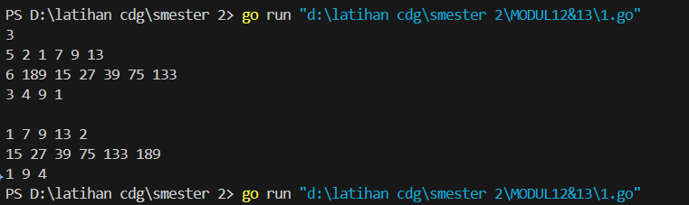
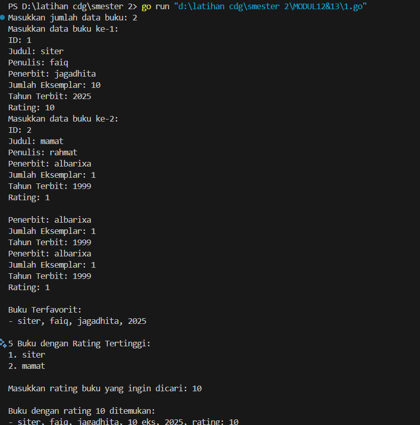

<h1 style="text-align: center;">Laporan Praktikum Modul 12&13<br></h1>
<p style="text-align: center;">Fa'iq Jagadhita Hadiana - 103112430015</p>

___
## Guided

___
#### Soal 1

```go
package main

import "fmt"

func selectionSortAsc(arr []int, panjang int) {
	var temp, i, j, idxMin int
	for i = 0; i < panjang-1; i++ {
		idxMin = i
		for j = i + 1; j < panjang; j++ {
			if arr[j] < arr[idxMin] {
				idxMin = j
			}
		}
		temp = arr[idxMin]
		arr[idxMin] = arr[i]
		arr[i] = temp
	}
}

func selectionSortDesc(arr []int, panjang int) {
	var temp, i, j, idxMax int
	for i = 0; i < panjang-1; i++ {
		idxMax = i
		for j = i + 1; j < panjang; j++ {
			if arr[j] > arr[idxMax] {
				idxMax = j
			}
		}
		temp = arr[idxMax]
		arr[idxMax] = arr[i]
		arr[i] = temp
	}
}

func main() {
	n := 10
	numbers := []int{12, 7, 3, 2, 9, 6, 8, 1, 11, 4}

	var ganjil []int
	var genap []int

	for i := 0; i < n; i++ {
		if numbers[i]%2 == 1 {
			ganjil = append(ganjil, numbers[i])
		} else {
			genap = append(genap, numbers[i])
		}
	}

	selectionSortAsc(ganjil, len(ganjil))
	selectionSortDesc(genap, len(genap))

	for i := 0; i < len(ganjil); i++ {
		fmt.Print(ganjil[i], " ")
	}
	for i := 0; i < len(genap); i++ {
		fmt.Print(genap[i], " ")
	}
}
```


Penjelasan : 
Program diawali dengan pembuatan array berisi kumpulan bilangan yang akan diolah. Kemudian, angka-angka tersebut dipisahkan menjadi dua kategori: bilangan ganjil dimasukkan ke dalam array `ganjil`, sedangkan bilangan genap dimasukkan ke dalam array `genap`. Masing-masing array kemudian diurutkan secara mandiri: array `ganjil` diurutkan secara menaik menggunakan fungsi `selectionSortAsc`, dan array `genap` diurutkan secara menurun menggunakan `selectionSortDesc`. Setelah proses pengurutan selesai, kedua array tersebut ditampilkan dengan urutan ganjil terlebih dahulu lalu diikuti genap. Dengan demikian, output yang dihasilkan sudah sesuai dengan kriteria yang diminta dalam soal, yaitu angka ganjil urut naik diikuti angka genap urut turun.

#### Soal 2

```go
package main

import "fmt"

type identitas struct {
	nim  string
	nilai int
}

func nilaiujian(arr []identitas) {
	var temp identitas
	for i := 1; i < len(arr); i++ {
		temp = arr[i]
		j := i

		for j > 0 && temp.nilai > arr[j-1].nilai {
			arr[j] = arr[j-1]
			j--
		}

		arr[j] = temp
	}
}

func main() {
	orang := []identitas{
		{"101", 75},
		{"102", 90},
		{"103", 85},
		{"104", 95},
		{"105", 80},
	}

	nilaiujian(orang)

	for i := 0; i < len(orang); i++ {
		fmt.Println(orang[i].nama, ": ", orang[i].nilai)
	}
}
```


Penjelasan : 
Program ini bertujuan untuk mengurutkan data nilai ujian beberapa siswa menggunakan algoritma _Insertion Sort_ dalam bahasa Go. Setiap siswa direpresentasikan dalam sebuah struct bernama `identitas`, yang terdiri dari dua atribut: `nama` dan `nilai`. Di dalam fungsi `main`, terdapat array berisi data lima siswa dengan nama dan nilai masing-masing. Fungsi `nilaiujian` digunakan untuk mengurutkan array tersebut berdasarkan nilai secara menurun (dari yang tertinggi ke terendah). Proses pengurutan dilakukan dengan membandingkan satu per satu elemen dari array yang belum terurut dengan bagian array yang sudah terurut, kemudian menyisipkan elemen tersebut ke posisi yang sesuai. Setelah proses pengurutan selesai, hasil akhir ditampilkan dalam bentuk daftar nama siswa beserta nilai mereka, dimulai dari yang memiliki nilai tertinggi hingga terendah. Program ini cocok digunakan untuk menyajikan data hasil ujian secara rapi dan terurut.

___
## Unguided

___

#### Soal 1 Selection Short

```go
package main

import (
	"fmt"
)

func selectionSort(arr []int) {
	n := len(arr)
	for i := 0; i < n-1; i++ {
		minIdx := i
		for j := i + 1; j < n; j++ {
			if arr[j] < arr[minIdx] {
				minIdx = j
			}
		}
		// Tukar elemen
		arr[i], arr[minIdx] = arr[minIdx], arr[i]
	}
}

func main() {
	var n int
	fmt.Scan(&n) // jumlah daerah

	allData := make([][]int, n)

	// Ambil semua input terlebih dahulu
	for i := 0; i < n; i++ {
		var m int
		fmt.Scan(&m)

		houses := make([]int, m)
		for j := 0; j < m; j++ {
			fmt.Scan(&houses[j])
		}
		allData[i] = houses
	}

	// Proses dan keluarkan output setelah semua input selesai
	for i := 0; i < n; i++ {
		selectionSort(allData[i])
		for j, val := range allData[i] {
			fmt.Print(val)
			if j != len(allData[i])-1 {
				fmt.Print(" ")
			}
		}
		fmt.Println()
	}
}
```


Penjelasan :
Program ini dibuat untuk mengurutkan nomor rumah kerabat Hercules di beberapa daerah secara menaik (ascending) menggunakan metode selection sort. Pertama, program membaca jumlah daerah, lalu untuk setiap daerah, program membaca jumlah rumah dan nomor-nomor rumah kerabat di daerah tersebut. Data setiap daerah disimpan dalam array dua dimensi. Setelah semua data dimasukkan, program mengurutkan nomor rumah di tiap daerah menggunakan selection sort, yaitu dengan mencari angka terkecil dari sisa elemen dan menukarnya ke posisi yang benar. Setelah proses pengurutan selesai, program mencetak hasilnya per baris sesuai urutan daerah, dengan nomor rumah dipisahkan oleh spasi. Program ini membantu menampilkan data secara rapi dan terurut sesuai kebutuhan soal.

#### Soal 2 Selection Short

```go
package main

import "fmt"

func selectionSortAsc(arr []int) {
	for i := 0; i < len(arr)-1; i++ {
		idxMin := i
		for j := i + 1; j < len(arr); j++ {
			if arr[j] < arr[idxMin] {
				idxMin = j
			}
		}
		arr[i], arr[idxMin] = arr[idxMin], arr[i]
	}
}

func selectionSortDesc(arr []int) {
	for i := 0; i < len(arr)-1; i++ {
		idxMax := i
		for j := i + 1; j < len(arr); j++ {
			if arr[j] > arr[idxMax] {
				idxMax = j
			}
		}
		arr[i], arr[idxMax] = arr[idxMax], arr[i]
	}
}

func bacaInput() [][]int {
	var jumlahDaerah, jumlahRumah int
	fmt.Scan(&jumlahDaerah)
	semuaDaerah := make([][]int, jumlahDaerah)

	for i := 0; i < jumlahDaerah; i++ {
		fmt.Scan(&jumlahRumah)
		ganjil := []int{}
		genap := []int{}

		for j := 0; j < jumlahRumah; j++ {
			var nomor int
			fmt.Scan(&nomor)
			if nomor%2 == 0 {
				genap = append(genap, nomor)
			} else {
				ganjil = append(ganjil, nomor)
			}
		}

		selectionSortAsc(ganjil)
		selectionSortDesc(genap)

		semuaDaerah[i] = append(ganjil, genap...)
	}

	return semuaDaerah
}

func tampilkanOutput(daerah [][]int) {
	for i := 0; i < len(daerah); i++ {
		for j := 0; j < len(daerah[i]); j++ {
			if j > 0 {
				fmt.Print(" ")
			}
			fmt.Print(daerah[i][j])
		}
		fmt.Println()
	}
}

func main() {
	data := bacaInput()
	fmt.Println()
	tampilkanOutput(data)
}
```



Penjelasan :
Program ini merupakan pengembangan dari program sebelumnya, dengan penyesuaian agar Hercules tidak perlu terlalu sering menyeberang jalan. Setiap nomor rumah yang dimasukkan dipisahkan menjadi dua kelompok: bilangan ganjil dan bilangan genap. Nomor ganjil akan diurutkan secara menaik (ascending), sedangkan nomor genap diurutkan secara menurun (descending) menggunakan algoritma selection sort. Setelah proses pengurutan selesai, kedua kelompok digabung dan ditampilkan per daerah dengan urutan ganjil terlebih dahulu, kemudian genap. Hal ini bertujuan agar kunjungan dilakukan di sisi jalan yang sama terlebih dahulu sebelum berpindah sisi.

#### Soal 3 Selection Short

```go
package main

import (
	"fmt"
)

// Selection Sort function
func selectionSort(arr []int) {
	n := len(arr)
	for i := 0; i < n-1; i++ {
		minIdx := i
		for j := i + 1; j < n; j++ {
			if arr[j] < arr[minIdx] {
				minIdx = j
			}
		}
		arr[i], arr[minIdx] = arr[minIdx], arr[i]
	}
}

// Fungsi untuk mendapatkan median
func getMedian(arr []int) int {
	selectionSort(arr) // urutkan data
	n := len(arr)
	if n%2 == 1 {
		return arr[n/2]
	}
	return (arr[n/2-1] + arr[n/2]) / 2 // dibulatkan ke bawah
}

func main() {
	var input int
	data := []int{}

	for {
		fmt.Scan(&input)
		if input == -5313 {
			break
		} else if input == 0 {
			// saat menemukan 0, hitung median dan cetak
			if len(data) > 0 {
				// buat salinan agar data asli tidak terganggu oleh pengurutan
				temp := make([]int, len(data))
				copy(temp, data)
				median := getMedian(temp)
				fmt.Println(median)
			}
		} else {
			data = append(data, input)
		}
	}
}
```


Penjelasan :
Program ini dirancang untuk menghitung nilai median dari kumpulan data bilangan bulat positif yang dibaca dari input. Setiap kali ditemukan angka 0, program akan menghitung dan mencetak median dari seluruh data yang sudah masuk sebelumnya, sedangkan angka -5313 digunakan sebagai penanda akhir input. Untuk menghitung median, program mengurutkan salinan data menggunakan algoritma selection sort agar data asli tetap utuh. Median ditentukan dari posisi tengah data yang sudah diurutkan — jika jumlah data ganjil, median adalah angka di tengah, sedangkan jika genap, median adalah rata-rata dua angka tengah yang dibulatkan ke bawah. Pendekatan ini membantu mendapatkan nilai tengah secara tepat dari data yang terus bertambah, sesuai instruksi soal.

#### Soal 1 Insertion Short

```go
package main

import (
	"fmt"
)

// Fungsi insertion sort
func insertionSort(arr []int) {
	for i := 1; i < len(arr); i++ {
		key := arr[i]
		j := i - 1
		for j >= 0 && arr[j] > key {
			arr[j+1] = arr[j]
			j--
		}
		arr[j+1] = key
	}
}

// Fungsi untuk memeriksa apakah array berjarak tetap
func checkSameDistance(arr []int) (bool, int) {
	if len(arr) < 2 {
		return true, 0
	}
	distance := arr[1] - arr[0]
	for i := 2; i < len(arr); i++ {
		if arr[i]-arr[i-1] != distance {
			return false, 0
		}
	}
	return true, distance
}

func main() {
	var input int
	data := []int{}

	// Input sampai bilangan negatif
	for {
		fmt.Scan(&input)
		if input < 0 {
			break
		}
		data = append(data, input)
	}

	// Urutkan data
	insertionSort(data)

	// Tampilkan hasil sorting
	for _, v := range data {
		fmt.Print(v, " ")
	}
	fmt.Println()

	// Cek apakah data berjarak tetap
	sameDistance, distance := checkSameDistance(data)
	if sameDistance {
		fmt.Printf("Data berjarak %d\n", distance)
	} else {
		fmt.Println("Data berjarak tidak tetap")
	}
}
```


Penjelasan :
Program ini digunakan untuk mengurutkan sekumpulan bilangan bulat positif yang dibaca dari input, kemudian memeriksa apakah angka-angka tersebut memiliki jarak yang tetap antara satu dengan yang lain. Program dimulai dengan membaca angka satu per satu sampai menemukan angka negatif sebagai penanda akhir input. Semua angka yang valid disimpan ke dalam array, lalu diurutkan menggunakan algoritma insertion sort. Setelah proses pengurutan selesai, hasilnya ditampilkan, kemudian dicek apakah selisih antar angka yang berdekatan selalu sama. Jika ya, maka program mencetak bahwa data berjarak tetap beserta nilai jaraknya, jika tidak maka program menyatakan bahwa jarak antar datanya tidak tetap. Program ini membantu mengenali pola keteraturan dalam data yang diberikan.

#### Soal 2 Insertion Short

```go
package main

import (
	"fmt"
)

const nMax = 7919

type Buku struct {
	ID       string
	Judul    string
	Penulis  string
	Penerbit string
	Eks      int
	Tahun    int
	Rating   int
}

type DaftarBuku []Buku

func DaftarkanBuku(n int) DaftarBuku {
	pustaka := make(DaftarBuku, n)
	for i := 0; i < n; i++ {
		fmt.Printf("Masukkan data buku ke-%d:\n", i+1)
		fmt.Print("ID: ")
		fmt.Scan(&pustaka[i].ID)
		fmt.Print("Judul: ")
		fmt.Scan(&pustaka[i].Judul)
		fmt.Print("Penulis: ")
		fmt.Scan(&pustaka[i].Penulis)
		fmt.Print("Penerbit: ")
		fmt.Scan(&pustaka[i].Penerbit)
		fmt.Print("Jumlah Eksemplar: ")
		fmt.Scan(&pustaka[i].Eks)
		fmt.Print("Tahun Terbit: ")
		fmt.Scan(&pustaka[i].Tahun)
		fmt.Print("Rating: ")
		fmt.Scan(&pustaka[i].Rating)
	}
	return pustaka
}

func CetakTerfavorit(pustaka DaftarBuku) {
	maxRating := -1
	for _, buku := range pustaka {
		if buku.Rating > maxRating {
			maxRating = buku.Rating
		}
	}
	fmt.Println("\nBuku Terfavorit:")
	for _, buku := range pustaka {
		if buku.Rating == maxRating {
			fmt.Printf("- %s, %s, %s, %d\n", buku.Judul, buku.Penulis, buku.Penerbit, buku.Tahun)
		}
	}
}

func UrutBuku(pustaka DaftarBuku) {
	for i := 1; i < len(pustaka); i++ {
		key := pustaka[i]
		j := i - 1
		for j >= 0 && pustaka[j].Rating < key.Rating {
			pustaka[j+1] = pustaka[j]
			j--
		}
		pustaka[j+1] = key
	}
}

func Cetak5Terbaru(pustaka DaftarBuku) {
	fmt.Println("\n5 Buku dengan Rating Tertinggi:")
	count := 5
	if len(pustaka) < 5 {
		count = len(pustaka)
	}
	for i := 0; i < count; i++ {
		b := pustaka[i]
		fmt.Printf("%d. %s\n", i+1, b.Judul)
	}
}

func CariBuku(pustaka DaftarBuku, r int) {
	left, right := 0, len(pustaka)-1
	for left <= right {
		mid := (left + right) / 2
		if pustaka[mid].Rating == r {
			b := pustaka[mid]
			fmt.Printf("\nBuku dengan rating %d ditemukan:\n", r)
			fmt.Printf("- %s, %s, %s, %d eks, %d, rating: %d\n", b.Judul, b.Penulis, b.Penerbit, b.Eks, b.Tahun, b.Rating)
			return
		} else if pustaka[mid].Rating < r {
			right = mid - 1
		} else {
			left = mid + 1
		}
	}
	fmt.Println("\nTidak ada buku dengan rating seperti itu.")
}

func main() {
	var n int
	fmt.Print("Masukkan jumlah data buku: ")
	fmt.Scan(&n)

	pustaka := DaftarkanBuku(n)
	CetakTerfavorit(pustaka)
	UrutBuku(pustaka)
	Cetak5Terbaru(pustaka)

	var rating int
	fmt.Print("\nMasukkan rating buku yang ingin dicari: ")
	fmt.Scan(&rating)
	CariBuku(pustaka, rating)
}
```



Penjelasan :
Program ini dibuat untuk mengelola data buku di sebuah perpustakaan dengan berbagai fitur penting. Pertama, pengguna diminta untuk memasukkan data setiap buku, seperti ID, judul, penulis, penerbit, jumlah eksemplar, tahun terbit, dan rating. Setelah data dimasukkan, program mencari dan menampilkan buku dengan rating tertinggi sebagai buku terfavorit. Selanjutnya, buku-buku diurutkan berdasarkan rating dari yang tertinggi ke terendah menggunakan algoritma insertion sort. Setelah diurutkan, lima buku dengan rating tertinggi akan ditampilkan. Terakhir, program memungkinkan pengguna untuk mencari satu buku berdasarkan rating tertentu menggunakan pencarian biner. Jika buku dengan rating tersebut ditemukan, informasi lengkapnya akan ditampilkan; jika tidak, akan ditampilkan pesan bahwa buku dengan rating tersebut tidak tersedia. Program ini cocok untuk mengelola dan menampilkan data buku secara rapi dan efisien sesuai kebutuhan perpustakaan.