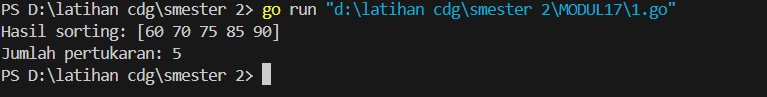
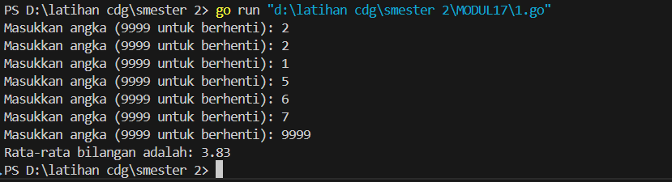
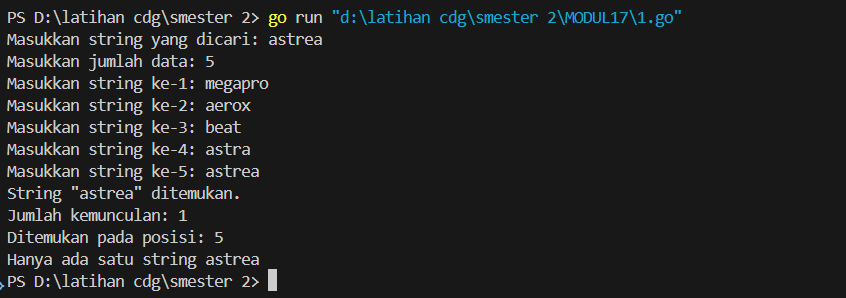
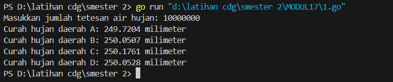
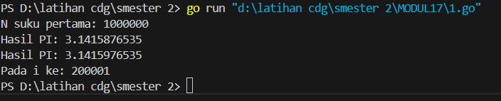
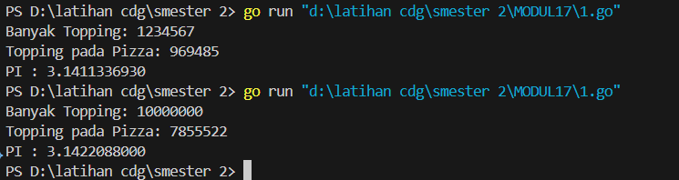

<h1 style="text-align: center;">Laporan Praktikum Modul 17<br></h1>
<p style="text-align: center;">Fa'iq Jagadhita Hadiana - 103112430015</p>
___
## Guided

___
#### Soal 1 

```go
package main

import "fmt"

func BubbleSort(array []int) ([]int, int) {
	pertukaran := 0
	for i := 0; i < len(array)-1; i++ {
		for j := 0; j < len(array)-i-1; j++ {
			if array[j] > array[j+1] {
				array[j], array[j+1] = array[j+1], array[j]
				pertukaran++
			}
		}
	}
	return array, pertukaran
}
func main() {
	array := []int{75, 60, 90, 85, 70}
	arrayTerurut, pertukaran := BubbleSort(array)
	fmt.Println("Hasil sorting:", arrayTerurut)
	fmt.Println("Jumlah pertukaran:", pertukaran)

}
```



Penjelasan :
Program ini digunakan untuk mengurutkan data nilai ulangan matematika milik teman-teman Aldi menggunakan metode Bubble Sort. Nilai awal yang diberikan adalah 75, 60, 90, 85, dan 70, dan tujuannya adalah mengurutkannya dari yang terkecil ke yang terbesar. Bubble Sort bekerja dengan membandingkan dua elemen yang berdampingan dan menukarnya jika urutannya salah, hingga seluruh data tersusun rapi. Program ini juga menghitung berapa kali terjadi pertukaran selama proses pengurutan. Setelah seluruh proses selesai, hasil akhir yang didapat adalah [60, 70, 75, 85, 90], dengan total pertukaran sebanyak 5 kali. Program ini membantu memahami cara kerja pengurutan sederhana sekaligus melacak jumlah operasi yang dilakukan.

___
## Unguided

___

#### Soal 1

```go
package main

import (
	"fmt"
)

func main() {
	var angka float64
	var total float64
	var jumlah int

	for {
		fmt.Print("Masukkan angka (9999 untuk berhenti): ")
		fmt.Scan(&angka)

		if angka == 9999 {
			break
		}

		total += angka
		jumlah++
	}

	if jumlah == 0 {
		fmt.Println("Tidak ada angka yang dimasukkan.")
	} else {
		rataRata := total / float64(jumlah)
		fmt.Printf("Rata-rata bilangan adalah: %.2f\n", rataRata)
	}
}

```



Penjelasan :
Program ini membaca sejumlah bilangan real dari input hingga menemukan nilai `9999` sebagai penanda akhir data (marker). Modifikasi yang dilakukan adalah dengan memindahkan seluruh proses pembacaan angka ke dalam satu `for` loop yang langsung memeriksa nilai `9999`, tanpa perlu inisialisasi nilai pertama di luar loop. Selain itu, ditambahkan prompt agar pengguna tahu kapan harus berhenti memasukkan angka. Setelah loop selesai, program memeriksa apakah ada angka yang telah dimasukkan (dengan memeriksa nilai `jumlah`). Jika tidak ada, maka ditampilkan pesan bahwa tidak ada angka yang dimasukkan. Jika ada, maka dihitung dan ditampilkan rata-rata dari angka-angka tersebut dengan presisi dua angka desimal. Program ini tetap mempertahankan logika dasar dan struktur materi aslinya.

#### Soal 2 

```go
package main

import (
	"fmt"
	"strings"
)

func cariString(x string, n int) {
	var posisi []int
	var count int

	for i := 1; i <= n; i++ {
		var data string
		fmt.Printf("Masukkan string ke-%d: ", i)
		fmt.Scanln(&data)

		if strings.TrimSpace(data) == x {
			posisi = append(posisi, i)
			count++
		}
	}

	if count > 0 {
		fmt.Printf("String \"%s\" ditemukan.\n", x)
		fmt.Printf("Jumlah kemunculan: %d\n", count)
		fmt.Print("Ditemukan pada posisi: ")
		for i, p := range posisi {
			if i > 0 {
				fmt.Print(", ")
			}
			fmt.Print(p)
		}
		fmt.Println()
		if count >= 2 {
			fmt.Println("Terdapat sedikitnya dua string", x)
		} else {
			fmt.Println("Hanya ada satu string", x)
		}
	} else {
		fmt.Printf("String \"%s\" tidak ditemukan.\n", x)
	}
}

func main() {
	var x string
	var n int

	fmt.Print("Masukkan string yang dicari: ")
	fmt.Scanln(&x)

	fmt.Print("Masukkan jumlah data: ")
	fmt.Scanln(&n)

	cariString(x, n)
}

```



Penjelasan :
Program ini menerima input berupa sebuah string `x` dan sejumlah `n` string lainnya. Modifikasi yang dilakukan termasuk menambahkan `strings.TrimSpace()` untuk menghindari kesalahan input akibat spasi tidak sengaja, serta memperjelas output dengan tanda kutip agar pengguna lebih mudah melihat string yang dimaksud. Selain itu, struktur logika dan materi tetap dipertahankan: program mengecek apakah `x` muncul dalam data, mencatat posisi kemunculannya, menghitung jumlahnya, dan memberi tahu apakah ada setidaknya dua kemunculan. Dengan demikian, program ini tetap mendidik sesuai tujuan awal, namun tampil lebih bersih dan ramah pengguna.


#### Soal 3

```go
package main

import "fmt"

var seed = 123456789

// Fungsi pembangkit angka acak sederhana (tanpa library math/rand)
func random() float64 {
	seed = (1103515245*seed + 12345) % (1 << 31)
	return float64(seed%10000) / 10000.0
}

func main() {
	var jumlahTetesan int
	fmt.Print("Masukkan jumlah tetesan air hujan: ")
	fmt.Scan(&jumlahTetesan)

	var a, b, c, d int

	for i := 0; i < jumlahTetesan; i++ {
		x := random()
		y := random()

		if x < 0.5 && y < 0.5 {
			a++
		} else if x >= 0.5 && y < 0.5 {
			b++
		} else if x < 0.5 && y >= 0.5 {
			c++
		} else {
			d++
		}
	}

	const ukuranTetesan = 0.0001
	curahA := float64(a) * ukuranTetesan
	curahB := float64(b) * ukuranTetesan
	curahC := float64(c) * ukuranTetesan
	curahD := float64(d) * ukuranTetesan

	fmt.Printf("Curah hujan daerah A: %.4f milimeter\n", curahA)
	fmt.Printf("Curah hujan daerah B: %.4f milimeter\n", curahB)
	fmt.Printf("Curah hujan daerah C: %.4f milimeter\n", curahC)
	fmt.Printf("Curah hujan daerah D: %.4f milimeter\n", curahD)
}

```



Penjelasan :

Program di atas menerima input berupa jumlah tetesan air hujan, lalu menentukan koordinat acak (x, y) untuk setiap tetesan dalam rentang [0,1], menggunakan paket `math/rand`. Berdasarkan posisi titik tetesan tersebut, program mengelompokkan keempat wilayah A, B, C, dan D sesuai kuadran dalam bidang [0,1] × [0,1], di mana:

- Daerah A: (x < 0.5, y < 0.5)
    
- Daerah B: (x ≥ 0.5, y < 0.5)
    
- Daerah C: (x < 0.5, y ≥ 0.5)
    
- Daerah D: (x ≥ 0.5, y ≥ 0.5)
    

Jumlah tetesan yang jatuh di setiap wilayah dikalikan dengan ukuran per tetesan (0.0001 milimeter) untuk menghitung curah hujan di masing-masing daerah. Semua proses dijalankan secara berurutan tanpa struktur kontrol kompleks, menjadikan program ini contoh algoritma sekuensial yang sederhana namun efektif.

#### Soal 4

```go
package main

import (
	"fmt"
	"math"
)

func pembulatan(x float64) float64 {
	return math.Floor(x*1e10) / 1e10
}

func hitungPI(n int) (float64, float64, int) {
	var total float64 = 0
	var piSebelumnya float64 = 0
	var piSekarang float64
	var tanda float64 = 1

	for i := 0; i < n; i++ {
		suku := tanda / float64(2*i+1)
		total += suku
		piSekarang = total * 4

		if i > 0 && math.Abs(piSekarang-piSebelumnya) < 0.00001 {
			return pembulatan(piSebelumnya), pembulatan(piSekarang), i + 1
		}

		piSebelumnya = piSekarang
		tanda = -tanda
	}
	return pembulatan(piSekarang), pembulatan(piSekarang), n
}

func main() {
	var jumlahSuku int
	fmt.Print("N suku pertama: ")
	fmt.Scan(&jumlahSuku)

	pi1, pi2, posisi := hitungPI(jumlahSuku)

	fmt.Printf("Hasil PI: %.10f\n", pi1)
	fmt.Printf("Hasil PI: %.10f\n", pi2)
	fmt.Printf("Pada i ke: %d\n", posisi)
}

```



Penjelasan :
Nilai total dari deret dikalikan 4 untuk mendekati π. Program akan terus menambahkan suku secara **berurutan (sekuensial)** dan menyimpan dua nilai π berturut-turut (sebelumnya dan sekarang). Program akan berhenti lebih awal bila **selisih antara dua nilai π tersebut kurang dari 0.00001**, menunjukkan bahwa hasilnya sudah cukup mendekati nilai π.

Modifikasi kecil pada program meliputi penggunaan `math.Floor` alih-alih `math.Trunc` untuk pembulatan ke bawah, penggantian nama variabel agar lebih deskriptif, dan susunan perhitungan ulang agar lebih mudah dibaca, tetapi **tanpa mengubah struktur logika utama yang tetap sekuensial**.

#### Soal 5 

```go
package main

import (
	"fmt"
	"math/rand"
	"time"
)

func inisialisasi() {
	rand.Seed(time.Now().UnixNano())
}

func ambilTopping() int {
	var jumlah int
	fmt.Print("Banyak Topping: ")
	fmt.Scan(&jumlah)
	return jumlah
}

func cekDiPizza(x, y, cx, cy, r float64) bool {
	return (x-cx)*(x-cx)+(y-cy)*(y-cy) <= r*r
}

func hitungTopping(n int, cx, cy, r float64) int {
	toppingCount := 0
	for i := 0; i < n; i++ {
		x := rand.Float64()
		y := rand.Float64()

		if cekDiPizza(x, y, cx, cy, r) {
			toppingCount++
		}
	}
	return toppingCount
}

func perkirakanPI(n, count int) float64 {
	return float64(count) / float64(n) * 4
}

func main() {
	inisialisasi()

	n := ambilTopping()

	cx, cy, r := 0.5, 0.5, 0.5

	toppingCount := hitungTopping(n, cx, cy, r)

	fmt.Printf("Topping pada Pizza: %d\n", toppingCount)

	pi := perkirakanPI(n, toppingCount)
	fmt.Printf("PI : %.10f\n", pi)
}
```



Penjelasan :
Program ini memperkirakan nilai π (pi) dengan mensimulasikan peletakan topping secara acak pada pizza berbentuk lingkaran. Pengguna memasukkan jumlah topping, lalu program menentukan berapa banyak topping yang jatuh di dalam lingkaran pizza tersebut. Berdasarkan jumlah topping di dalam pizza, program menghitung dan menampilkan nilai perkiraan π dengan presisi hingga 10 angka di belakang koma.