<h1 style="text-align: center;">Laporan Praktikum Modul 2<br>REVIEW PENGENALAN PEMROGRAMAN</h1>
<p style="text-align: center;">Fa'iq Jagadhita Hadiana - 103112430015</p>
___
### Soal 2A

1. Program Pertama
```go
package main

  

import "fmt"

  

func main() {

    var (

        satu, dua, tiga string

        temp string

    )

    fmt.Print("Masukan input string: ")

    fmt.Scanln(&satu)

    fmt.Print("Masukan input string: ")

    fmt.Scanln(&dua)

    fmt.Print("Masukan input string: ")

    fmt.Scanln(&tiga)

    fmt.Println("Output awal = " + satu + " " + dua + " " + tiga)

    temp = satu

    satu = dua

    dua = tiga

    tiga = temp

    fmt.Println("Output akhir = " + satu + " " + dua + " " + tiga)

}
```

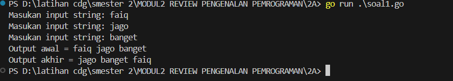

Penjelasan : Setelah saya telusuri, program di atas meminta pengguna untuk memasukkan tiga string secara berurutan. Setelah semua string dimasukkan, program menampilkan urutan awal dari ketiga string tersebut. Selanjutnya, program melakukan pertukaran posisi string: string pertama dipindahkan ke posisi kedua, string kedua berpindah ke posisi ketiga, dan string ketiga ditempatkan di posisi pertama. Untuk membantu dalam proses pertukaran ini, program menggunakan variabel sementara `temp`. Setelah pertukaran selesai, program mencetak hasil akhir dengan urutan string yang sudah berubah.

2. Tahun kabisat
```go
package main

  

import "fmt"

  

func main() {

    var tahun int

    fmt.Print("Masukkan Tahun: ")

    fmt.Scan(&tahun)

  

    if tahun%400 == 0 || (tahun%4 == 0 && tahun%100 != 0) {

        fmt.Println("Tahun Kabisat: true")

    } else {

        fmt.Println("Tahun Kabisat: false")

    }

}
```

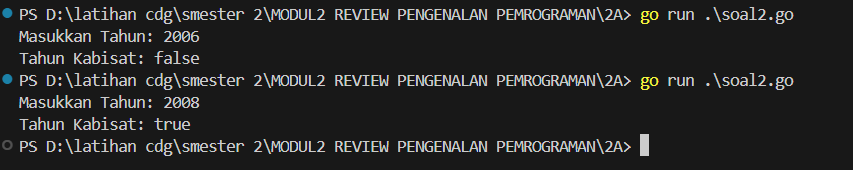

Penjelasan : Program ini berfungsi untuk menentukan apakah suatu tahun merupakan tahun kabisat atau tidak. Pengguna diminta memasukkan sebuah tahun, lalu program memeriksa apakah tahun tersebut memenuhi aturan tahun kabisat dalam kalender Gregorian. Tahun dikatakan kabisat jika habis dibagi 400 atau jika habis dibagi 4 tetapi tidak habis dibagi 100. Jika salah satu dari kondisi tersebut terpenuhi, program mencetak "Tahun Kabisat: true", sedangkan jika tidak, program mencetak "Tahun Kabisat: false".

3. Program Bola
```go
package main

  

import "fmt"

  

func main() {

    var jarijari float64

    fmt.Print("Jari-jari = ")

    fmt.Scan(&jarijari)

  

    volume := (4.0 / 3.0) * 3.1415926535 * (jarijari * jarijari * jarijari)

    luas := 4 * 3.1415926535 * (jarijari * jarijari)

  

    fmt.Printf("Bola dengan jari-jari %.0f memiliki volume %.4f dan luas kulit %.4f\n", jarijari, volume, luas)

}
```

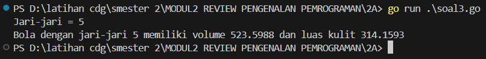

Penjelasan : Program ini menghitung volume dan luas permukaan sebuah bola berdasarkan jari-jari yang dimasukkan oleh pengguna. Setelah pengguna memasukkan nilai jari-jari, program menggunakan rumus volume bola yaitu (4/3) * π * r³ dan luas permukaan bola yaitu 4 * π * r² dengan π (pi) mendekati 3.1415926535. Hasil perhitungan kemudian ditampilkan dalam format desimal, di mana jari-jari ditampilkan sebagai bilangan bulat, sementara volume dan luas permukaan ditampilkan dengan empat angka di belakang koma.

4. suhu
```go
package main

  

import "fmt"

  

func main() {

    var celsius float64

    fmt.Print("Temperatur Celsius: ")

    fmt.Scan(&celsius)

  

    reamur := (4.0 / 5.0) * celsius

    fahrenheit := (9.0 / 5.0) * celsius + 32

    kelvin := celsius + 273

  

    fmt.Printf("Derajat Reamur: %.0f\n", reamur)

    fmt.Printf("Derajat Fahrenheit: %.0f\n", fahrenheit)

    fmt.Printf("Derajat Kelvin: %.0f\n", kelvin)

}
```

![[2a4.png]]

Penjelasan : Program ini mengonversi suhu dari skala Celsius ke tiga skala suhu lainnya: Reamur, Fahrenheit, dan Kelvin. Pengguna diminta memasukkan suhu dalam derajat Celsius, lalu program menghitung konversinya menggunakan rumus: Reamur = (4/5) × Celsius, Fahrenheit = (9/5) × Celsius + 32, dan Kelvin = Celsius + 273.

5. Program ASCII
```go
package main

  

import (

    "fmt"

)

  

func main() {

    var a, b, c, d, e int

    var x, y, z byte

  

    fmt.Scan(&a, &b, &c, &d, &e)

    fmt.Scanln()

  

    fmt.Scanf("%c%c%c", &x, &y, &z)

  

    fmt.Printf("%c%c%c%c%c\n", a, b, c, d, e)

    fmt.Printf("%c%c%c\n", x+1, y+1, z+1)

}
```

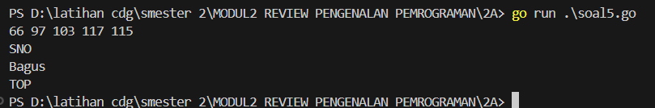

Penjelasan : Program ini menerima lima angka dan tiga karakter dari input pengguna. Lima angka pertama diperlakukan sebagai kode ASCII, kemudian dikonversi menjadi karakter dan ditampilkan sebagai sebuah teks. Setelah itu, program membaca tiga karakter tambahan tanpa spasi, lalu menaikkan setiap karakter satu tingkat dalam kode ASCII sebelum mencetak hasil akhirnya. Jadi, jika pengguna memasukkan angka yang mewakili huruf dalam ASCII serta karakter seperti 'A', 'B', 'C', maka outputnya akan menampilkan teks sesuai angka yang dimasukkan dan karakter yang telah bergeser satu tingkat ke depan dalam ASCII.
___
### Soal 2B

1. Program Warna
```go
package main

  

import "fmt"

  

func main() {

    var warna1, warna2, warna3, warna4 string

    berhasil := true

  

    for i := 1; i <= 5; i++ {

        fmt.Printf("Percobaan %d: ", i)

        fmt.Scan(&warna1, &warna2, &warna3, &warna4)

  

        if warna1 != "merah" || warna2 != "kuning" || warna3 != "hijau" || warna4 != "ungu" {

            berhasil = false

        }

    }

  

    fmt.Println("BERHASIL:", berhasil)

}
```

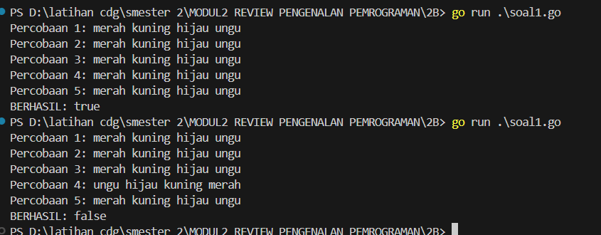
 
 Penjelasan : Program ini meminta pengguna untuk memasukkan empat warna sebanyak lima kali dalam sebuah perulangan. Pada setiap percobaan, program membaca empat warna yang diinput oleh pengguna dan membandingkannya dengan urutan yang sudah ditentukan, yaitu "merah", "kuning", "hijau", dan "ungu". Jika dalam salah satu percobaan ada warna yang tidak sesuai, variabel berhasil diubah menjadi false. Setelah lima percobaan selesai, program mencetak hasil akhir dengan menampilkan "BERHASIL: true" jika semua input sesuai di setiap percobaan, atau "BERHASIL: false" jika ada satu saja percobaan yang tidak memenuhi urutan warna yang diharapkan.

2. Program bunga
```go
package main

  

import "fmt"

  

func main() {

    var bunga, pita string

    var count int

  

    for {

        fmt.Printf("Bunga %d: ", count+1)

        fmt.Scan(&bunga)

  

        if bunga == "SELESAI" {

            break

        }

  

        if pita == "" {

            pita = bunga

        } else {

            pita += " - " + bunga

        }

  

        count++

    }

  

    fmt.Println("Pita:", pita+" -")

    fmt.Println("Bunga:", count)

}
```

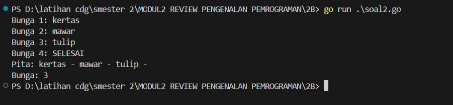

Penjelasan : Program ini meminta pengguna untuk memasukkan nama bunga secara berulang hingga pengguna mengetik "SELESAI". Setiap nama bunga yang dimasukkan akan disusun dalam sebuah string dengan format dipisahkan oleh tanda " - ". Jika pengguna belum memasukkan bunga pertama, maka langsung disimpan ke dalam variabel pita. Jika sudah ada bunga sebelumnya, maka nama bunga baru ditambahkan ke dalam pita dengan tanda pemisah. Variabel count digunakan untuk menghitung jumlah bunga yang dimasukkan. Setelah pengguna mengetik "SELESAI", program menampilkan daftar bunga dalam format yang telah disusun serta jumlah total bunga yang telah dimasukkan.

3. Program Berat Belanjaan
```go
package main

  

import "fmt"

  

func main() {

    var berat1, berat2, total float64

  

    for {

        fmt.Print("Masukan berat belanjaan di kedua kantong: ")

        fmt.Scan(&berat1, &berat2)

  

        if berat1 < 0 || berat2 < 0 || total+berat1+berat2 > 150 {

            break

        }

  

        total += berat1 + berat2

  

        if berat1-berat2 >= -9 && berat1-berat2 <= 9 {

            fmt.Println("Sepeda motor Pak Andi akan oleng: false")

        } else {

            fmt.Println("Sepeda motor Pak Andi akan oleng: true")

        }

    }

  

    fmt.Println("Proses selesai.")

}
```

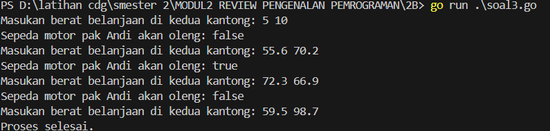

Penjelasan : Program ini membaca berat belanjaan di dua kantong secara berulang-ulang. Setiap kali pengguna memasukkan dua angka yang mewakili berat barang di masing-masing kantong, program akan memeriksa apakah selisih berat antara kedua kantong lebih dari atau sama dengan 9 kg. Jika iya, program mencetak bahwa sepeda motor akan oleng (true), jika tidak, program mencetak false. Proses ini terus berulang sampai salah satu dari tiga kondisi terpenuhi: berat di salah satu kantong negatif, total berat yang sudah dimasukkan melebihi 150 kg, atau pengguna menghentikan input. Setelah itu, program mencetak "Proses selesai."

1. Program akar
```go
package main

  

import "fmt"

  

func main() {

    var K int

    fmt.Print("Masukkan nilai K: ")

    fmt.Scan(&K)

  

    akar2 := 1.0

    for i := 0; i <= K; i++ {

        pembilang := (4*i + 2) * (4*i + 2)

        penyebut := (4*i + 1) * (4*i + 3)

        akar2 *= float64(pembilang) / float64(penyebut)

    }

  

    fmt.Printf("Nilai akar 2 = %.10f\n", akar2)

}
```

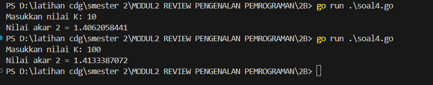

Penjelasan : Program ini menghitung perkiraan nilai akar 2 menggunakan metode iteratif dengan formula tertentu. Pengguna diminta memasukkan nilai **K**, yang menentukan jumlah iterasi perhitungan. Variabel **akar2** diinisialisasi dengan nilai 1.0 dan kemudian diperbarui dalam loop yang berjalan dari 0 hingga **K**. Dalam setiap iterasi, program menghitung nilai pembilang dan penyebut berdasarkan rumus tertentu, lalu mengalikannya ke dalam **akar2**. Setelah iterasi selesai, program mencetak hasil akhir dengan 10 angka di belakang desimal sebagai perkiraan nilai akar 2.

___
### Soal 2C

1. Program Biaya Pengiriman 
```go
package main

  

import "fmt"

  

func main() {

    var berat int

    fmt.Print("Berat parsel (gram): ")

    fmt.Scan(&berat)

  

    kg := berat / 1000

    gram := berat % 1000

  

    hargakg := kg * 10000

    hargagram := 0

  

    if gram > 0 {

        if gram >= 500 {

            hargagram = gram * 5

        } else {

            hargagram = gram * 15

        }

    }

  

    if kg >= 10 {

        hargagram = 0

    }

    total := hargakg + hargagram

  

    fmt.Printf("Detail berat: %d kg + %d gr\n", kg, gram)

    fmt.Printf("Detail biaya: Rp. %d + Rp. %d\n", hargakg, hargagram)

    fmt.Printf("Total biaya: Rp. %d\n", total)

}
```

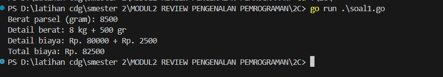

Penjelasan : Program ini menghitung biaya pengiriman parsel berdasarkan berat yang dimasukkan oleh pengguna dalam satuan gram. Berat tersebut dipecah menjadi kilogram dan gram, lalu dihitung biaya pengirimannya. Setiap kilogram dikenakan biaya Rp. 10.000, sementara sisa gram dihitung berdasarkan ketentuan tertentu: jika lebih dari atau sama dengan 500 gram, biaya per gramnya Rp. 5, sedangkan jika kurang dari 500 gram, biayanya Rp. 15 per gram. Namun, jika total berat mencapai atau melebihi 10 kg, biaya tambahan dari gram diabaikan. Setelah perhitungan selesai, program menampilkan rincian berat dalam kg dan gram, rincian biaya dari masing-masing bagian, serta total biaya keseluruhan.

2. Program Nilai 
```go
// yang belum di perbaiki


package main

  

import "fmt"

  

func main() {

  

    var nam float64

    var nmk string

  

    fmt.Print(“Nilai akhir mata kuliah: “)

    fmt.Scanln(&nam)

  

    if nam > 80 {

        nam = “A”

    }

    if nam > 72.5 {

        nam = “AB”

    }

    if nam > 65 {

        nam = “B”

    }

     if nam > 57.5 {

        nam = “BC”

    }

    if nam > 50 {

        nam = “C”

    }

     if nam > 40 {

        nam = “D”

    } else if nam <= 40 {
    
        nam = “E”

    }

  

    fmt.Println(“Nilai mata kuliah: “, nmk)

  

}
```


```go
// setelah di perbaiki
package main

  

import "fmt"

  

func main() {

  

    var nam float64

    var nmk string

  

    fmt.Print("Nilai akhir mata kuliah: ")

    fmt.Scanln(&nam)

  

    if nam > 80 {

        nmk = "A"

    } else if nam > 72.5 && nam <= 80 {

        nmk = "AB"

    } else if nam > 65 && nam <= 72.5 {

        nmk = "B"

    } else if nam > 57.5 && nam <= 65 {

        nmk = "BC"

    } else if nam > 50 && nam <= 57.5 {

        nmk = "C"

    } else if nam > 40 && nam <= 50 {

        nmk = "D"

    } else if nam <= 40 {

        nmk = "E"

    }

  

    fmt.Println("Nilai mata kuliah:", nmk)

}
```

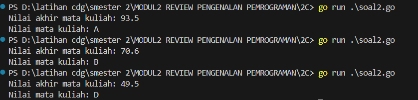

Penjelasan : Program memiliki beberapa kesalahan, seperti tidak menggunakan `else if`, sehingga semua kondisi dievaluasi meskipun sudah ada yang terpenuhi. Selain itu, variabel yang digunakan untuk menyimpan output seharusnya `nmk`, bukan `nam`, karena `nam` bertipe `float64`. Rentang nilai juga tidak ditentukan dengan benar, menyebabkan hasil tidak sesuai dengan kriteria. Kesalahan lain terdapat pada penggunaan tanda petik yang kurang tepat. Setelah diperbaiki, program menghasilkan output yang sesuai dengan spesifikasi soal.


3.  Program Bilangan Prima 
```go
package main

  

import "fmt"

  

func main() {

    var b int

    fmt.Print("Bilangan: ")

    fmt.Scan(&b)

  

    fmt.Print("Faktor: ")

    count := 0

    for i := 1; i <= b; i++ {

        if b%i == 0 {

            fmt.Print(i, " ")

            count++

        }

    }

    fmt.Println()

  

    prima := count == 2

    fmt.Println("Prima:", prima)

}
```

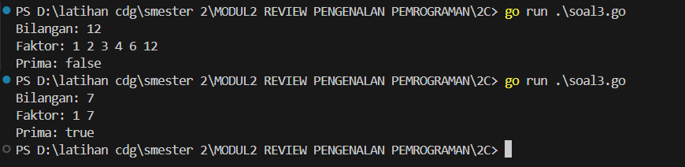

Penjelasan : Program ini menerima sebuah bilangan bulat dari pengguna dan menentukan faktor-faktor dari bilangan tersebut dengan melakukan iterasi dari 1 hingga bilangan itu sendiri. Setiap kali bilangan tersebut habis dibagi oleh suatu angka tanpa sisa, angka itu dianggap sebagai faktor dan langsung dicetak, sekaligus menambah jumlah faktor yang ditemukan. Setelah semua faktor dihitung, program memeriksa apakah jumlah faktor sama dengan dua, yang berarti bilangan tersebut hanya memiliki faktor 1 dan dirinya sendiri, dan oleh karena itu merupakan bilangan prima. Hasil pemeriksaan ini kemudian ditampilkan dengan mencetak nilai true jika bilangan tersebut prima, atau false jika tidak.