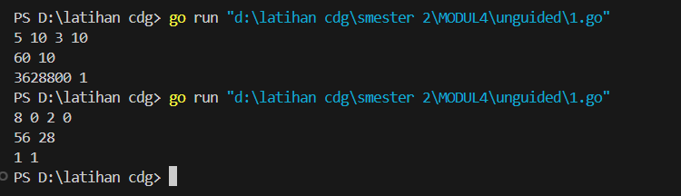
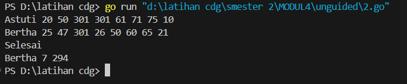
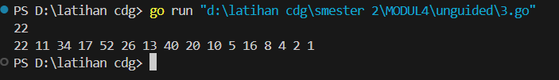

<h1 style="text-align: center;">Laporan Praktikum Modul 4<br>PROSEDUR</h1>
<p style="text-align: center;">Fa'iq Jagadhita Hadiana - 103112430015</p>
___
### Soal 1

```go
package main

import "fmt"

func permutation(n, r int, hasil *int) {
	var faktorialN, faktorialNR int

	factorial(n, &faktorialN)
	factorial(n-r, &faktorialNR)
	*hasil = faktorialN / faktorialNR
}

func factorial(n int, hasil *int) {
	*hasil = 1
	for i := 1; i <= n; i++ {
		*hasil *= i
	}
}

func combination(n, r int, hasil *int) {
	var faktorialN, faktorialR, faktorialNR int

	factorial(n, &faktorialN)
	factorial(r, &faktorialR)
	factorial(n-r, &faktorialNR)
	*hasil = faktorialN / (faktorialR * faktorialNR)
}

func main() {
	var a, b, c, d, permutationA, permutationB, combinationA, combinationB int
	fmt.Scan(&a, &b, &c, &d)

	if a >= c && b >= d {
		permutation(a, c, &permutationA)
		combination(a, c, &combinationA)
		permutation(b, d, &permutationB)
		combination(b, d, &combinationB)
		fmt.Println(permutationA, combinationA)
		fmt.Println(permutationB, combinationB)
	} else {
		fmt.Print("Input tidak valid")
	}

}
```


Penjelasan :
Program di atas adalah implementasi dalam bahasa Go untuk menghitung permutasi dan kombinasi dari dua pasang bilangan. Program ini memiliki tiga fungsi utama: permutation, combination, dan factorial. Fungsi factorial bertugas menghitung nilai faktorial dari suatu bilangan dengan menggunakan perulangan dari 1 hingga bilangan tersebut, lalu menyimpan hasilnya di variabel yang diakses melalui pointer. Fungsi permutation menggunakan fungsi factorial untuk menghitung permutasi dari dua bilangan n dan r dengan rumus P(n, r) = n! / (n - r)!, sedangkan fungsi combination menghitung kombinasi dengan rumus C(n, r) = n! / (r! × (n - r)!). Pada fungsi main, program membaca empat bilangan bulat dari input pengguna, yaitu a, b, c, dan d. Setelah itu, program memeriksa apakah a ≥ c dan b ≥ d untuk memastikan bahwa operasi permutasi dan kombinasi valid. Jika kondisi tersebut terpenuhi, program menghitung permutasi dan kombinasi untuk pasangan (a, c) serta (b, d), kemudian mencetak hasilnya secara berpasangan di dua baris yang berbeda. Jika kondisi tidak terpenuhi, program mencetak pesan "Input tidak valid". Program ini memanfaatkan pointer untuk mengakses dan memodifikasi nilai secara langsung, yang memungkinkan penggunaan memori yang lebih efisien.

___
### Soal 2

```go
package main

import "fmt"

func itungSkor(soal, skor *int) {
	var time int

	*soal = 0
	*skor = 0

	for i := 0; i < 8; i++ {
		fmt.Scan(&time)
		if time < 301 {
			*soal++
			*skor += time
		}
	}
}

func main() {

	var nama, menang string
	var soal, skor, maksimumSoal, minimumSkor int

	maksimumSoal = -1
	minimumSkor = 99999

	for {
		fmt.Scan(&nama)

		if nama == "Selesai" || nama == "selesai" {
			break
		}

		itungSkor(&soal, &skor)

		if soal > maksimumSoal || (soal == maksimumSoal && skor < minimumSkor) {
			maksimumSoal = soal
			minimumSkor = skor
			menang = nama
		}
	}

	fmt.Println(menang, maksimumSoal, minimumSkor)
}
```



Penjelasan :
Program di atas adalah implementasi dalam bahasa Go yang digunakan untuk menentukan pemenang dalam sebuah kompetisi pemrograman berdasarkan jumlah soal yang diselesaikan dan total waktu yang dibutuhkan. Program ini memiliki dua bagian utama, yaitu fungsi itungSkor dan fungsi utama main. Fungsi itungSkor digunakan untuk menghitung jumlah soal yang diselesaikan dan total skor waktu dari delapan soal yang diberikan. Dalam setiap iterasi, waktu pengerjaan soal dibaca, dan jika waktu tersebut kurang dari atau sama dengan 300 detik, maka jumlah soal yang diselesaikan bertambah dan waktu tersebut ditambahkan ke total skor. Namun, dalam kode tersebut terdapat kesalahan pada ekspresi soal++ yang seharusnya ditulis sebagai *(soal)++ agar increment dilakukan dengan benar.*

Di fungsi main, program membaca nama peserta satu per satu sampai pengguna memasukkan kata "Selesai" atau "selesai". Untuk setiap peserta, fungsi itungSkor dipanggil untuk menghitung jumlah soal yang diselesaikan dan total waktu yang dihabiskan. Program kemudian membandingkan hasil tersebut dengan skor maksimum dan minimum yang tersimpan. Jika jumlah soal yang diselesaikan lebih banyak atau jika jumlah soal sama tetapi total waktu lebih sedikit, maka peserta tersebut dianggap sebagai pemenang sementara. Pada akhirnya, setelah semua peserta diproses, program mencetak nama pemenang, jumlah soal yang diselesaikan, dan total waktu yang dibutuhkan. Logika penentuan pemenang memprioritaskan jumlah soal yang lebih banyak, dan jika jumlahnya sama, peserta dengan total waktu lebih kecil akan menang.

___
### Soal 3

```go
package main

import "fmt"

func cetakDeret(n int) {
	for {
		fmt.Print(n, " ")
		if n == 1 {
			break
		}

		if n%2 == 0 {
			n /= 2
		} else {
			n = n*3 + 1
		}
	}
}

func main() {

	var n int
	fmt.Scan(&n)

	if n > 0 && n < 1000 {
		cetakDeret(n)
	}

}
```



Penjelasan : 
Program di atas adalah implementasi dalam bahasa Go untuk mencetak sebuah deret angka berdasarkan aturan tertentu. Program ini terdiri dari dua bagian utama, yaitu fungsi cetakDeret dan fungsi main. Fungsi cetakDeret digunakan untuk mencetak deret angka yang dimulai dari bilangan n yang diberikan sebagai input. Setiap angka dalam deret dicetak dengan spasi di antaranya, dan proses berhenti ketika nilai n menjadi 1. Pada setiap iterasi, jika n adalah bilangan genap, maka n dibagi dua. Sebaliknya, jika n adalah bilangan ganjil, maka n dikalikan tiga lalu ditambah satu. Fungsi main berperan untuk membaca input n dari pengguna. Program hanya akan menjalankan fungsi cetakDeret jika nilai n berada dalam rentang antara 1 hingga 999. Jika nilai n tidak memenuhi syarat tersebut, maka program tidak melakukan apa-apa.