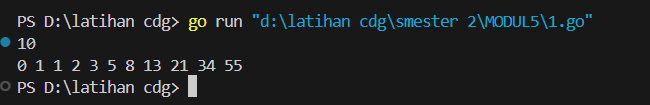
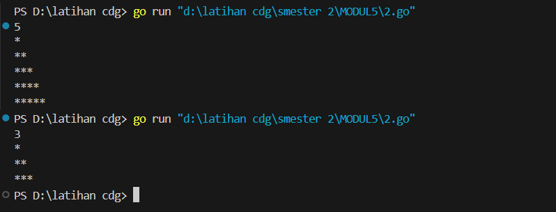
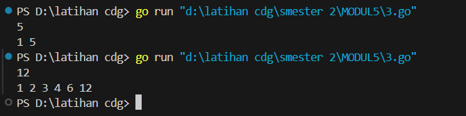
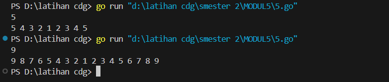

<h1 style="text-align: center;">Laporan Praktikum Modul 5<br>REKRUSIF</h1>
<p style="text-align: center;">Fa'iq Jagadhita Hadiana - 103112430015</p>
___
### Soal 1

```go
package main

import "fmt"

func fibonacci(n int) int {
	if n < 2 {
		return n
	}
	hasil := fibonacci(n-1) + fibonacci(n-2)
	return hasil
}

func cetakFibonacci(i, n int) {
	fmt.Print(fibonacci(i), " ")
	if i < n {
		cetakFibonacci(i+1, n)
	}
}

func main() {
	var n int
	fmt.Scan(&n)
	cetakFibonacci(0, n)
}
```


Penjelasan :
Program di atas adalah implementasi dalam bahasa Go untuk mencetak deret Fibonacci hingga suku ke-**n** menggunakan rekursi. Fungsi **fibonacci** menghitung nilai Fibonacci pada indeks ke-**n** secara rekursif dengan memanggil dirinya sendiri untuk **fibonacci(n-1) + fibonacci(n-2)**, sementara fungsi **cetakFibonacci** digunakan untuk mencetak deret Fibonacci dari indeks ke-**0** hingga ke-**n** dengan memanggil dirinya sendiri hingga indeks mencapai **n**. Fungsi **main** membaca input bilangan bulat **n** dari pengguna, lalu memanggil **cetakFibonacci** untuk mencetak deret tersebut. Pendekatan ini kurang efisien untuk nilai **n** yang besar karena pemanggilan rekursif berulang, sehingga bisa dioptimalkan dengan pendekatan iteratif atau menggunakan memoization.

___
### Soal 2

```go
package main

import "fmt"

func bintang(n int) {
	if n != 0 {
		fmt.Print("*")
		bintang(n - 1)
	}
}

func bentuk(n, baris int) {
	if baris <= n {
		bintang(baris)
		fmt.Println()
		bentuk(n, baris+1)
	}
}

func main() {
	var n int
	fmt.Scan(&n)
	bentuk(n, 1)
}
```



Penjelasan : 
Program di atas adalah implementasi dalam bahasa Go untuk mencetak pola segitiga bintang menggunakan rekursi. Fungsi **bintang** digunakan untuk mencetak sejumlah bintang dalam satu baris, di mana setiap pemanggilan rekursif akan mencetak satu bintang hingga jumlah yang diinginkan tercapai. Fungsi **bentuk** bertugas membentuk pola segitiga dengan memanggil fungsi **bintang** secara berurutan mulai dari satu bintang hingga mencapai jumlah maksimum yang diberikan oleh pengguna, kemudian mencetak baris baru setelah setiap pemanggilan **bintang**. Fungsi **main** membaca input bilangan bulat **n** dari pengguna, lalu memanggil fungsi **bentuk** dengan parameter awal **1** untuk memulai pembentukan pola segitiga secara rekursif.

___
### Soal 3

```go
package main

import "fmt"

func faktorBilangan(n, i int) {
	if i <= n {
		if n%i == 0 {
		fmt.Print(i, " ")
		}
		faktorBilangan(n, i+1)
	}
}

func main() {
	var n int
	fmt.Scan(&n)
	faktorBilangan(n, 1)
}
```



Penjelasan :
Program di atas adalah implementasi dalam bahasa Go untuk mencetak semua faktor dari sebuah bilangan menggunakan rekursi. Fungsi **faktorBilangan** digunakan untuk memeriksa apakah suatu bilangan **i** adalah faktor dari bilangan **n** dengan mengecek apakah **n % i == 0**. Jika iya, maka **i** dicetak. Fungsi ini kemudian memanggil dirinya sendiri dengan menambah nilai **i** hingga mencapai nilai **n**. Fungsi **main** bertugas untuk membaca input bilangan bulat **n** dari pengguna, lalu memanggil fungsi **faktorBilangan** mulai dari **1** hingga **n** untuk mencetak semua faktor dari bilangan tersebut.

___
### Soal 4

```go
package main

import "fmt"


func barisan(n, angka int) {
	fmt.Print(angka, " ")
	if angka > 1 {
		barisan(n, angka-1)
		fmt.Print(angka, " ")
	}
}

func main() {

	var n int
	fmt.Scan(&n)
	barisan(n, n)

}
```



Penjelasan :
Program di atas adalah implementasi dalam bahasa Go untuk mencetak pola barisan angka menggunakan rekursi. Fungsi **barisan** mencetak angka mulai dari **n** hingga **1** secara menurun, lalu mencetak kembali angka dari **2** hingga **n** secara menaik setelah rekursi kembali. Setiap kali fungsi dipanggil, angka saat ini dicetak, kemudian fungsi memanggil dirinya sendiri dengan nilai **angka - 1** sampai mencapai **1**. Setelah mencapai **1**, proses rekursi berbalik arah dan mencetak angka saat fungsi kembali ke pemanggil sebelumnya. Fungsi **main** membaca input bilangan bulat **n** dari pengguna dan memanggil fungsi **barisan** untuk mencetak pola tersebut. Pola yang dihasilkan simetris dengan puncaknya di angka **1**.

___
### Soal 5

```go
package main

import "fmt"

func cetakGanjil(i, n int) {
	if i <= n {
		fmt.Print(i, " ")
		cetakGanjil(i+2, n)
	}
}

func main() {
	var n int
	fmt.Scan(&n)
	cetakGanjil(1, n)
}
```


Penjelasan :
Program di atas adalah implementasi dalam bahasa Go untuk mencetak bilangan ganjil dari 1 hingga **n** menggunakan rekursi. Fungsi **cetakGanjil** menerima dua parameter, yaitu **i** sebagai bilangan yang akan dicetak dan **n** sebagai batas akhir. Jika nilai **i** masih kurang dari atau sama dengan **n**, maka **i** dicetak diikuti dengan spasi, lalu fungsi memanggil dirinya sendiri dengan menambahkan nilai **i** sebanyak 2, sehingga hanya bilangan ganjil yang dicetak. Fungsi **main** berfungsi untuk membaca input bilangan bulat **n** dari pengguna dan memanggil fungsi **cetakGanjil** mulai dari angka 1 hingga mencapai nilai **n**.