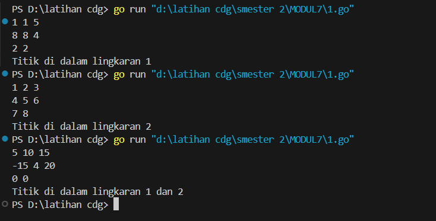
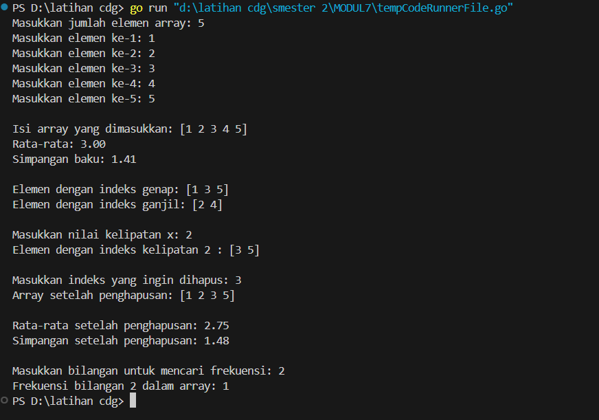
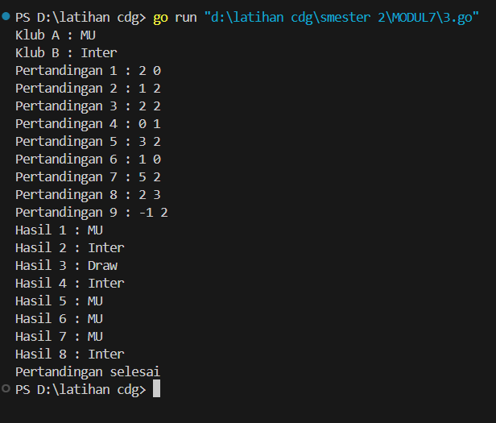
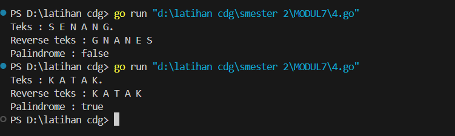

<h1 style="text-align: center;">Laporan Praktikum Modul 7<br>STRUCT & ARRAY</h1>
<p style="text-align: center;">Fa'iq Jagadhita Hadiana - 103112430015</p>

### Soal 1

```go
package main

import (
	"fmt"
	"math"
)

type Titik struct {
	x, y int
}

type Lingkaran struct {
	pusat  Titik
	radius int
}

func jarak(p, q Titik) float64 {
	return math.Sqrt(math.Pow(float64(p.x-q.x), 2) + math.Pow(float64(p.y-q.y), 2))
}

func didalam(c Lingkaran, p Titik) bool {
	return jarak(c.pusat, p) <= float64(c.radius)
}

func main() {
	var (
		cx1, cy1, r1 int
		cx2, cy2, r2 int
		x, y         int
	)

	fmt.Scan(&cx1, &cy1, &r1)
	fmt.Scan(&cx2, &cy2, &r2)
	fmt.Scan(&x, &y)

	lingkaran1 := Lingkaran{Titik{cx1, cy1}, r1}
	lingkaran2 := Lingkaran{Titik{cx2, cy2}, r2}
	titik := Titik{x, y}

	didalam1 := didalam(lingkaran1, titik)
	didalam2 := didalam(lingkaran2, titik)

	if didalam1 && didalam2 {
		fmt.Println("Titik di dalam lingkaran 1 dan 2")
	} else if didalam1 {
		fmt.Println("Titik di dalam lingkaran 1")
	} else if didalam2 {
		fmt.Println("Titik di dalam lingkaran 2")
	} else {
		fmt.Println("Titik di luar lingkaran 1 dan 2")
	}
}
```

Penjelasan :
Program ini adalah program yang digunakan untuk mengecek apakah sebuah titik berada di dalam dua buah lingkaran atau tidak. Di awal, program mendefinisikan tipe data untuk titik dan lingkaran, lalu ada fungsi `jarak` buat ngitung jarak antara dua titik pakai rumus matematika. Kemudian ada fungsi `didalam` buat ngecek apakah jarak titik ke pusat lingkaran lebih kecil atau sama dengan radius lingkarannya. Setelah itu di bagian utama, pengguna diminta memasukkan koordinat dan radius dari dua lingkaran, serta titik yang ingin dicek. Program lalu menentukan posisi titik itu, apakah masuk ke salah satu, kedua, atau tidak masuk ke lingkaran manapun.
### Soal 2
```go
package main

import (
	"fmt"
	"math"
)

func isiArray(jumlah int) []int {
	array := make([]int, jumlah)
	for i := 0; i < jumlah; i++ {
		fmt.Printf("Masukkan elemen ke-%d: ", i+1)
		fmt.Scan(&array[i])
	}
	return array
}

func ganjilGenap(array []int) ([]int, []int) {
	genap, ganjil := []int{}, []int{}
	for i := 0; i < len(array); i++ {
		if i%2 == 0 {
			genap = append(genap, array[i])
		} else {
			ganjil = append(ganjil, array[i])
		}
	}
	return genap, ganjil
}

func kelipatan(array []int, bilangan int) []int {
	hasil := []int{}
	for i := bilangan; i < len(array); i += bilangan {
		hasil = append(hasil, array[i])
	}
	return hasil
}

func hapusIndeks(array []int, indeks int) []int {
	if indeks < 0 || indeks >= len(array) {
		fmt.Println("Indeks tidak ditemukan")
		return array
	}
	return append(array[:indeks], array[indeks+1:]...)
}

func rataRata(array []int) float64 {
	total := 0
	for i := 0; i < len(array); i++ {
		total += array[i]
	}
	return float64(total) / float64(len(array))
}

func simpanganBaku(array []int) float64 {
	rata := rataRata(array)
	var jumlah float64
	for i := 0; i < len(array); i++ {
		jumlah += math.Pow(float64(array[i])-rata, 2)
	}
	return math.Sqrt(jumlah / float64(len(array)))
}

func frekuensi(array []int, angka int) int {
	jumlah := 0
	for i := 0; i < len(array); i++ {
		if array[i] == angka {
			jumlah++
		}
	}
	return jumlah
}

func main() {
	var jumlah, bilangan, indeks, angka int

	fmt.Print("Masukkan jumlah elemen array: ")
	fmt.Scan(&jumlah)

	if jumlah <= 0 {
		fmt.Println("Program berhenti karena jumlah elemen adalah <=0.")
		return
	}

	array := isiArray(jumlah)
	fmt.Println("\nIsi array yang dimasukkan:", array)
	fmt.Printf("Rata-rata: %.2f\n", rataRata(array))
	fmt.Printf("Simpangan baku: %.2f\n", simpanganBaku(array))

	genap, ganjil := ganjilGenap(array)
	fmt.Println("\nElemen dengan indeks genap:", genap)
	fmt.Println("Elemen dengan indeks ganjil:", ganjil)

	fmt.Print("\nMasukkan nilai kelipatan x: ")
	fmt.Scan(&bilangan)
	hasilKelipatan := kelipatan(array, bilangan)
	fmt.Println("Elemen dengan indeks kelipatan", bilangan, ":", hasilKelipatan)

	fmt.Print("\nMasukkan indeks yang ingin dihapus: ")
	fmt.Scan(&indeks)
	array = hapusIndeks(array, indeks)
	fmt.Println("Array setelah penghapusan:", array)

	fmt.Printf("\nRata-rata setelah penghapusan: %.2f\n", rataRata(array))
	fmt.Printf("Simpangan setelah penghapusan: %.2f\n", simpanganBaku(array))

	fmt.Print("\nMasukkan bilangan untuk mencari frekuensi: ")
	fmt.Scan(&angka)
	fmt.Printf("Frekuensi bilangan %d dalam array: %d\n", angka, frekuensi(array, angka))
}
```

Penjelasan :
Program ini adalah program yang dibuat untuk mengelola dan menganalisis data dalam bentuk array. Pertama-tama, user diminta buat masukin jumlah elemen dan datanya satu per satu. Program ini punya banyak fitur, seperti membagi array berdasarkan indeks genap dan ganjil, menampilkan elemen pada indeks kelipatan tertentu, menghapus elemen di indeks tertentu, lalu menghitung rata-rata dan simpangan baku dari datanya. Selain itu, ada juga fitur untuk mencari frekuensi kemunculan sebuah angka dalam array. 
### Soal 3
```go
package main

import "fmt"

func main() {
	var klubA, klubB string
	fmt.Print("Klub A : ")
	fmt.Scanln(&klubA)

	fmt.Print("Klub B : ")
	fmt.Scanln(&klubB)

	var hasil []string
	pertandingan := 1

	for {
		var skorA, skorB int
		fmt.Printf("Pertandingan %d : ", pertandingan)
		_, err := fmt.Scanf("%d %d\n", &skorA, &skorB)

		if err != nil || skorA < 0 || skorB < 0 {
			break
		}

		if skorA > skorB {
			hasil = append(hasil, klubA)
		} else if skorB > skorA {
			hasil = append(hasil, klubB)
		} else {
			hasil = append(hasil, "Draw")
		}

		pertandingan++
	}

	for i, v := range hasil {
		fmt.Printf("Hasil %d : %s\n", i+1, v)
	}

	fmt.Println("Pertandingan selesai")
}
```

Penjelasan :
Program ini adalah program untuk mencatat hasil pertandingan antara dua klub bola. Di awal program, pengguna diminta untuk memasukkan nama dua klub. Lalu secara berulang, user bisa input skor pertandingan mereka. Setiap skor akan langsung diproses untuk menentukan siapa pemenangnya atau kalau draw. Program terus berjalan sampai user memasukkan input yang tidak valid atau skor negatif, lalu menampilkan semua hasil pertandingan yang udah dicatat sebelumnya. 
### Soal 4
```go
package main

import "fmt"

const NMAX = 127
type tabel [NMAX]rune

func isiArray(t *tabel, n *int) {
	var huruf rune
	*n = 0
	fmt.Print("Teks : ")
	for {
		fmt.Scanf("%c", &huruf)
		if huruf == '.' || *n >= NMAX {
			break
		}
		if huruf != ' ' && huruf != '\n' {
			t[*n] = huruf
			*n++
		}
	}
}

func cetakArray(t tabel, n int) {
	for i := 0; i < n; i++ {
		fmt.Printf("%c ", t[i])
	}
	fmt.Println()
}

func balikkanArray(t *tabel, n int) {
	for i := 0; i < n/2; i++ {
		t[i], t[n-1-i] = t[n-1-i], t[i]
	}
}

func palindrom(t tabel, n int) bool {
	var temp tabel
	for i := 0; i < n; i++ {
		temp[i] = t[i]
	}
	var reversed tabel = temp
	balikkanArray(&reversed, n)

	for i := 0; i < n; i++ {
		if temp[i] != reversed[i] {
			return false
		}
	}
	return true
}

func main() {
	var t tabel
	var n int

	isiArray(&t, &n)

	fmt.Print("Reverse teks : ")
	var tCopy tabel
	for i := 0; i < n; i++ {
		tCopy[i] = t[i]
	}
	balikkanArray(&tCopy, n)
	cetakArray(tCopy, n)

	if palindrom(t, n) {
		fmt.Println("Palindrome : true")
	} else {
		fmt.Println("Palindrome : false")
	}
}
```

Penjelasan :
Program ini adalah program yang memproses input berupa teks dan mengecek apakah teks tersebut adalah palindrome atau bukan. Input-nya dimasukkan huruf per huruf (tanpa spasi), dan akan berhenti ketika pengguna mengetik titik. Semua huruf disimpan dalam array khusus bertipe rune. Setelah itu, program menampilkan teks versi kebalikannya. Kemudian, program membandingkan antara versi asli dan versi balik untuk menentukan apakah keduanya sama. Kalau sama, berarti input itu palindrome, kalau beda berarti bukan. Misalnya, kalau kita masukkan “senang”, maka setelah dibalik jadi “gnanes”, jelas beda, jadi bukan palindrome. Tapi kalau kita masukkan “katak”, hasil balikannya juga “katak”, jadi program akan kasih tahu bahwa itu palindrome. 